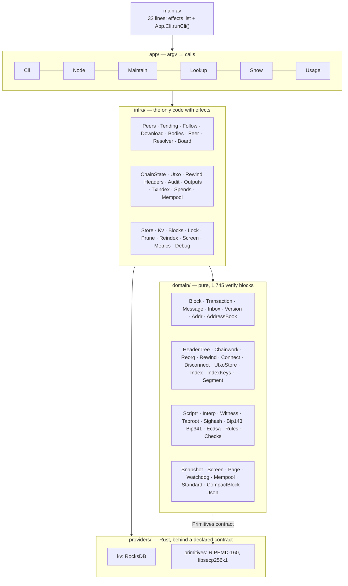
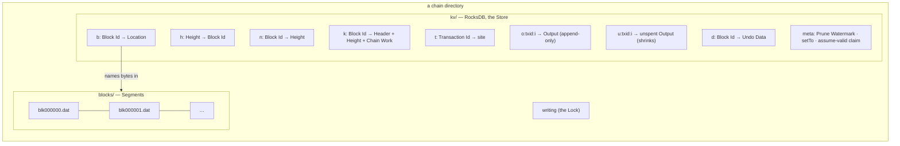
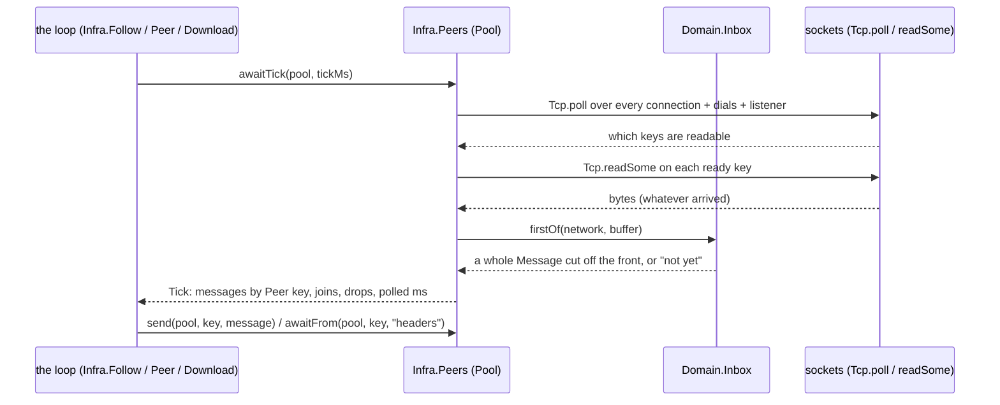
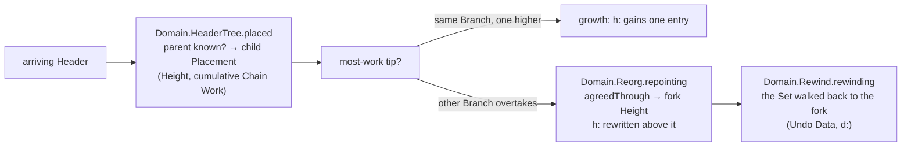
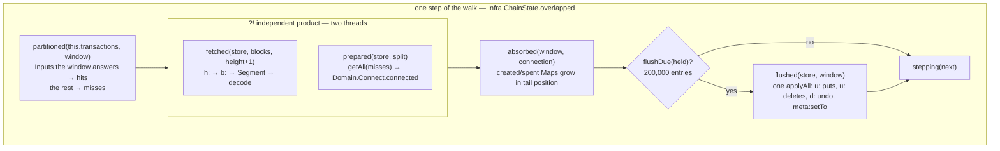
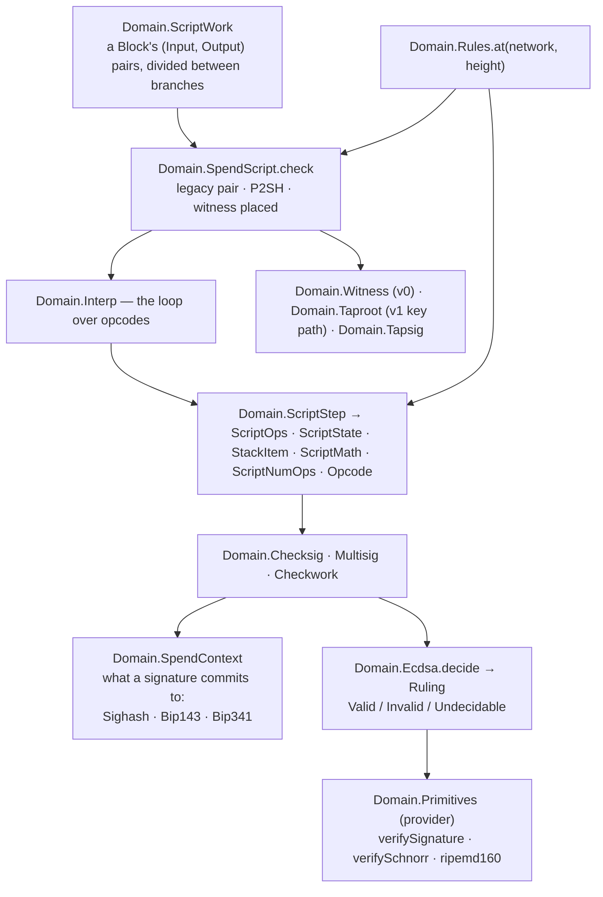

# Architecture

How this program is put together, section by section, with the reasoning
behind each shape and — because the shape is often the language's doing —
where Aver (the sibling `../aver` checkout, pinned by `.aver-version`) steered it. Every section links to the code it
describes; the line numbers are as of pin `74e24a5e` and drift a little with
every change — the function names are the stable part.

The one-paragraph version: a Bitcoin node written as a **pure core and a
thin, effectful shell**. `domain/` decides everything and touches nothing;
`infra/` is the only code that reads a socket or a disk and it is an
arrangement of `domain/` parts; `app/` turns argv into calls; `main.av` is
thirty lines. Persistent state is one keyed byte Store (RocksDB) plus
append-only Segment files of Block bodies. Several Peers share one polling
loop. The UTXO Set is built by connecting Blocks in Height order against a
write-back window, with the next Block's fetch running beside the current
one's resolve. Every answer the program gives has a third value — *cannot
tell* — that is never collapsed into pass or fail.

Contents

1. [The three layers](#1-the-three-layers)
2. [The command surface](#2-the-command-surface)
3. [What is stored: the Store, the Index and the Segments](#3-what-is-stored-the-store-the-index-and-the-segments)
4. [The network: a pool of Peers on one loop](#4-the-network-a-pool-of-peers-on-one-loop)
5. [The chain: Headers, work and reorganisation](#5-the-chain-headers-work-and-reorganisation)
6. [Downloading: the Header phase and the body phase](#6-downloading-the-header-phase-and-the-body-phase)
7. [The UTXO Set: connecting Blocks](#7-the-utxo-set-connecting-blocks)
8. [Following the tip: the node](#8-following-the-tip-the-node)
9. [The Script engine](#9-the-script-engine)
10. [Maintenance: audit, prune, reindex, lock](#10-maintenance-audit-prune-reindex-lock)
11. [How Aver steered the design](#11-how-aver-steered-the-design)
12. [Where the rest is written down](#12-where-the-rest-is-written-down)

---

## 1. The three layers

| Layer | Files | What may happen there | Tested by |
|---|---|---|---|
| [`main.av`](../main.av) | 1 | Declares the program's full effect set and calls the adapter | reachability |
| [`app/`](../app) | 6 | Parse argv, print usage, choose a command | verify blocks on the parsing |
| [`infra/`](../infra) | 28 | Sockets, disk, the database, the terminal, time, randomness | regtest end-to-end ([docs/regtest-testing.md](regtest-testing.md)) |
| [`domain/`](../domain) | 81 | Nothing. Every function is pure | colocated verify blocks (about 1,800) + the Core corpus (6,050 cases) |
| [`providers/`](../providers) | 2 crates | RocksDB; the curve | their own Rust tests |

**Why this split.** The claim the project wants to make is: *a failure against
a live peer is a socket problem, never an ambiguity in the pure code*. That
is only a claim worth making if the boundary is enforced, and in Aver it is:
a module lists its effects and a function lists its effects, both exactly
(see [§11](#11-how-aver-steered-the-design)). A `domain/` module has no
effects list at all, so `aver check` refuses the first line that would read
a socket from it. The layering is not a convention documented here and
hoped for; it is a compile error.

The consequence that shaped everything else: whenever a piece of `infra/`
grew a decision inside it, the decision was moved down into `domain/` so it
could be covered by cases, leaving `infra/` as the *carrying out* of a
decision made elsewhere. [`Infra.Blocks`](../infra/blocks.av) carries
[`Domain.Segment`](../domain/segment.av)'s decision about where a Block goes;
[`Infra.Screen`](../infra/screen.av) executes draw operations that
[`Domain.Screen`](../domain/screen.av) computed; [`Infra.Utxo`](../infra/utxo.av)
writes what [`Domain.Connect`](../domain/connect.av) decided. The intent
block at the top of each of those modules says so in its own words.

## 2. The command surface

Fifteen commands, dispatched in [`app/cli.av:114-126`](../app/cli.av#L114-L126)
after the optional network prefix (`signet`, `regtest`) is peeled off at
[`app/cli.av:81`](../app/cli.av#L81). The adapter knows nothing about what a
command does; it knows how many arguments it takes.

| Command | Adapter | Does | Writes |
|---|---|---|---|
| `headers` | [`Infra.Download.headers`](../infra/download.av#L32) | Learn the chain from one Peer, place every Header in the tree | `k:` `h:` `n:` |
| `bodies` | [`Infra.Bodies.bodies`](../infra/bodies.av#L73) | Fetch Block bodies for a Height range into Segments | Segments, `b:` |
| `txindex` | [`App.Maintain.txIndex`](../app/maintain.av) → [`Infra.TxIndex`](../infra/txindex.av#L45) | Where each Transaction lives | `t:` |
| `outputs` | [`Infra.Outputs`](../infra/outputs.av) | Every Output under the name an Input calls it by | `o:` |
| `utxo` | [`Infra.ChainState.build`](../infra/chainstate.av#L53) | Connect Blocks in order into the Set | `u:` `d:` `meta:setTo` |
| `assumevalid` | [`App.Maintain.assumeValid`](../app/maintain.av#L371) → [`Domain.AssumeValid`](../domain/assumevalid.av) | The Height below which Scripts are taken as settled | `meta:` |
| `follow` | [`App.Node.follow`](../app/node.av) → [`Infra.Follow.follow`](../infra/follow.av#L155) | All of the above, forever, driven by Peers; `screen`, `serve`, `log`, `http` | everything |
| `listen` | [`Infra.Peer`](../infra/peer.av) | One Peer, every Transaction it announces, printed | nothing |
| `show` | [`App.Show`](../app/show.av) over [`Infra.Chain`](../infra/chain.av) | One Block, rendered, with its findings | nothing |
| `tx` / `spend` | [`App.Lookup.byTxid`](../app/lookup.av) | A Transaction by Id; its Inputs followed back | nothing |
| `audit` | [`Infra.Audit.run`](../infra/audit.av#L39) | Every check over a range, counted | nothing |
| `prune` | [`Infra.Prune.run`](../infra/prune.av#L33) | Discard Segments below a Height, and say so | Segments, `b:`, watermark |
| `reindex` | [`Infra.Reindex.run`](../infra/reindex.av#L32) | Rebuild `b:` from the Segments | `b:` |
| `help` | [`App.Usage`](../app/usage.av) | | |

The ordering constraints between them (headers before bodies, bodies before
utxo, and so on) and every output format are in [README.md](../README.md);
this document is about why the parts are shaped as they are.

## 3. What is stored: the Store, the Index and the Segments

**One opaque Store, two backends.** [`Infra.Store`](../infra/store.av) is a
keyed byte store — `get`, `put`, `delete`, `getAll`, `applyAll` — whose
representation is a compile-time secret: `type Store` at
[`infra/store.av:47`](../infra/store.av#L47) is opaque, so no caller can build
one, read a field, or match on it. Behind it sits either a `Map` in memory
(what every verify block uses) or a RocksDB opened on the directory. The
memory backend is not a mock; it is the same Store with a different
`holding`, which is what lets the entire Index logic be verified without a
disk.

**The database is a contract, not a library.** Aver has `Disk` and nothing
else, so [`infra/kv.av`](../infra/kv.av) *declares* a key-value capability —
`open`, `get`, `getAll`, `putAll`, `applyAll`, `deleteAll`, `count`,
`prefixed` — with no bodies, and [`providers/kv`](../providers/kv/src/lib.rs)
supplies them from Rust over the `rocksdb` crate. The contract is hashed and
the provider pins the hash, so a provider built against an older contract
refuses to load rather than misbehave. The `Handle` is a capability resource:
Aver code cannot construct, copy or serialise one. The history is ADR
[0006](adr/0006-a-leveldb-under-the-index.md) (a log replayed into a Map,
which stopped scaling at a million entries) and ADR
[0009](adr/0009-rocksdb-under-the-index.md).

**Keys are tagged bytes.** [`Domain.IndexKeys`](../domain/indexkeys.av) spells
every key as a one-byte tag and fixed-width fields
([`tagged`](../domain/indexkeys.av#L115), [`blockKey`](../domain/indexkeys.av#L135));
[`Domain.Index`](../domain/index.av) and [`Domain.UtxoStore`](../domain/utxostore.av)
spell the values. Both are pure, so what an absent entry *means* in each
keyspace is a decided, verified thing rather than a convention.

**Two kinds of keyspace.** `b:`, `t:`, `n:`, `k:` and `o:` are append-only —
a Block Id always names the same bytes, so nothing ever needs rewriting.
`h:` is rewritten by a reorganisation and `u:` shrinks with every spend.
That difference is why `u:` and `o:` both exist ([§7](#7-the-utxo-set-connecting-blocks)).

**Segments are the source; the Index is derived.**
[`Domain.Segment`](../domain/segment.av) decides the name, the cap and where
the next Block goes; [`Infra.Blocks`](../infra/blocks.av) is the only module
that knows a Segment is a file. Every Block is one length-framed record
starting with its own 80-byte Header, so the Header's hash — the Block Id —
is recoverable by walking the files, which is exactly what
[`Infra.Reindex`](../infra/reindex.av) does to rebuild `b:` after a lost
Index. Reads are positional: a Location names its bytes and
[`Infra.Blocks.read`](../infra/blocks.av) never scans.

## 4. The network: a pool of Peers on one loop

[`Infra.Peers`](../infra/peers.av) (1,772 lines) owns every socket. The
design decisions, each written in its intent block:

- **Bytes arrive on their schedule, not ours.** The single-Peer code asked a
  socket for exactly 24 bytes and then exactly the announced payload. With
  several Peers an exact-length read holds the whole loop until it completes.
  So the pool reads whatever is there with `Tcp.readSome`, keeps a buffer per
  Peer, and [`Domain.Inbox.firstOf`](../domain/inbox.av#L74) cuts a whole
  Message off the front when one is present — verifying magic and checksum
  as it goes, which nothing did before #27.
- **Readiness is one `Tcp.poll`** over every connection, every in-flight dial
  and the listener, keyed by `Int`s the caller owns
  ([`awaitTick`](../infra/peers.av#L1501)). Since #202/#214 a dial is a key
  in that poll rather than a five-second stall
  ([`dialling`](../infra/peers.av#L905)).
- **A straight-line conversation on a shared loop.**
  [`awaitFrom(pool, key, wanted)`](../infra/peers.av#L1380) waits for one
  named command from one Peer while every other Peer is still read and
  pinged — the Header phase can be written as "send getheaders, await
  headers" without owning the loop. Messages nobody asked for are kept
  (bounded at 64) because Core answers a `getaddr` while we are waiting for
  `headers`, and draining them later is how the Address Book fills.
- **Two deadlines, not one.** 150 s of silence from the whole pool, and 60 s
  for a Peer to answer the question it was asked; with several Peers those
  stopped being the same fact.
- **A Peer that misbehaves costs itself.** A bad checksum, a body that does
  not hash to the Id it was asked under, a broken Handshake: the Peer is
  dropped and the node carries on. No banscore, because every fault
  detectable here is one Core disconnects on outright.
- **A failure that happened holding the pool carries the pool (#304).** A
  wait reads every Peer while it waits, so one that resets during a
  Handshake is closed and forgotten in the pool that wait is building. A
  Handshake that then fails reports it as a `Joined` that did not seat,
  carrying that pool; handing back only a reason let the caller fall back to
  the pool it held before the Handshake, which still named a socket the
  runtime had released, and the next `Tcp.poll` ended the node with nobody at
  fault — mainnet stopped that way twice in a day. Underneath it, a poll that
  names a released Connection sheds those Peers and asks again rather than
  failing the run: a socket the runtime does not know is one Peer's, like a
  failed read (#203), accept (#227) or write (#244). The catch-up path still
  rewinds this way ([`caughtUp`](../infra/follow.av)); the shedding is what
  keeps that from ending a run until it is threaded through too.

- **The company is kept while the node walks (#275).** The loop tends its
  Peers every turn; a Set catch-up used to tend them only between chunks,
  ten seconds apart, and a dial begun between two chunks was first looked at
  after the next — past its deadline — so a catching-up node gained no Peers.
  [`Infra.Tending`](../infra/tending.av) bundles the pool, the Address Book
  and the next key as **Kept** and tends them from the same Pool-level
  operations the loop uses: drain what arrived (kept as spare for the loop,
  pings answered by the pool), ask the dial what it became, seat and greet a
  Candidate that answered, top up, admit a caller off the listener, tell the
  Network where we are. The walk's Eye carries a `Kept` and tends it once a
  second ([`tendedCompany`](../infra/screen.av)); the chunk driver folds it
  back after every chunk. A Peer is a Peer within a second of answering,
  walking or listening.
- **A pool that empties re-seeds (#272).** Nobody left to dial is the normal
  state a minute after a restart; [`reseeded`](../infra/follow.av) asks the
  DNS seeds again rather than ending the run.

The Handshake and wire formats are pure: [`Domain.Version`](../domain/version.av),
[`Domain.Addr`](../domain/addr.av), [`Domain.Message`](../domain/message.av),
[`Domain.Inventory`](../domain/inventory.av), [`Domain.CompactBlock`](../domain/compactblock.av).
[`Domain.AddressBook`](../domain/addressbook.av) holds **Candidates** — Peer
Addresses heard about and not yet connected — which become Peers only on a
completed Handshake; CONTEXT.md is binding on both words. When no Peer is
named, [`Infra.Resolver`](../infra/resolver.av) asks a DNS seed over TCP, with
the question and answer built and read in pure [`Domain.Dns`](../domain/dns.av).

## 5. The chain: Headers, work and reorganisation

`k:` holds **every** Header seen, not only the ones on the chain followed.
[`Domain.HeaderTree`](../domain/headertree.av) is the tree — a `Map` of Block
Id to [`Placement`](../domain/headertree.av#L45) (parent, Height, work) — and
[`Domain.Chainwork`](../domain/chainwork.av) is the arithmetic, pinned against
Core's chainwork for mainnet Block 0. The chain followed is the Branch with
the **most work, never the longest**.

The Header phase used to assign Heights by counting. That is right exactly
while one Peer sends one chain in order, and wrong the first time it does
not, which is why [`Infra.Headers`](../infra/headers.av) now places each
Header in the tree and lets the tree decide what `h:` names.

Growth and reorganisation look identical from inside a walk — both are "the
tip moved". [`Domain.Reorg.repointing`](../domain/reorg.av#L38) tells them
apart by finding the Height through which the old and new Branches agree
([`agreedThrough`](../domain/reorg.av#L68)); above it, `h:` is rewritten.
[`Domain.Rewind.rewinding`](../domain/rewind.av#L28) then plans how far the
UTXO Set has to walk back, and [`Infra.Rewind`](../infra/rewind.av) carries it
out, reading the Set's own Branch out of `k:` — because `h:` no longer leads
there. This is why `meta:setTo` records `{height}:{blockId}` and a record
holding a bare Height is refused: a Height alone cannot say whether `h:` was
re-pointed underneath it. A fork below the 288-Block Undo window stops the
node with a report (decision D8) rather than being guessed past.

## 6. Downloading: the Header phase and the body phase

The two phases share nothing but a socket. One walks a Locator and writes
`k:` and `h:`; the other walks a range of Heights and writes Segments and
`b:`. They were one file until it outgrew what a reader can hold at once, so
they are [`Infra.Download`](../infra/download.av) and
[`Infra.Bodies`](../infra/bodies.av), each a **pool of one** — the same
[`Infra.Peers`](../infra/peers.av) machinery `follow` uses with eight.

The Header phase comes first because a `getdata` names Block Ids and never
Heights: the chain has to be known before any body can be asked for. Every
Header is fetched (all of them fit comfortably) and placed. The body phase
then asks for Locations in batches and, for each body that arrives, checks
that it hashes to the Id it was requested under
([`Domain.Block.idOfWholeBlock`](../domain/block.av)) before it is appended
to a Segment — an honest Peer is never accused, and a lying one is dropped.

Both phases claim the directory through [`Infra.Lock`](../infra/lock.av)
first ([`app/cli.av:193`](../app/cli.av#L193), [`:331`](../app/cli.av#L331)):
two writers appending to one Segment interleave their Blocks and every
Location both compute is wrong, which happened here to 62,000 Blocks before
an audit caught it.

## 7. The UTXO Set: connecting Blocks

This is the part of the program that has had the most engineering hours
since it first worked, because it is where a full node spends its time. The
walk is [`Infra.ChainState`](../infra/chainstate.av); the read/write of a
Block against a Store is [`Infra.Utxo`](../infra/utxo.av); the decision of
what a Block does to the Set is pure
[`Domain.Connect`](../domain/connect.av) and
[`Domain.Disconnect`](../domain/disconnect.av).

**Three rules, none about signatures.** [`Domain.Connect.connected`](../domain/connect.av#L113)
checks that every Input names an Output the Set holds, that value is
conserved per Transaction and per Block (fees against
[`Domain.Subsidy`](../domain/subsidy.av)), and that a coinbase Output is a
hundred Blocks old before it is spent — which is why every `u:` entry carries
the Height that made it and whether it came from a coinbase. Signatures are
the Script engine's business ([§9](#9-the-script-engine)) and are checked
by `audit`, not by the walk (ADR [0007](adr/0007-two-claims-two-tools.md)).

**Why `u:` and `o:` are both kept.** `o:` answers *what did this Input
spend*, which a reorganised Block still has to be able to ask, and only
grows. `u:` answers *may this Input spend it*, which only the current chain
can answer, and shrinks. Decision D3.

**Undo Data is keyed by Block Id, not Height** (`d:`), because a
reorganisation is exactly when it is read, and exactly when a Height stops
naming the Block it named before. [`Infra.Utxo.disconnectBlock`](../infra/utxo.av#L529)
puts the spent Outputs back from it.

**The write-back window (#247).** A Block's Outputs are mostly spent within a
few thousand Blocks, so the walk holds recently created and spent entries in
two `Map`s — [`Window`](../infra/utxo.av) — and asks the Store only for what
the window cannot answer ([`partitioned`](../infra/utxo.av#L53)); a flush
writes the survivors in one batch ([`flushed`](../infra/utxo.av#L270)). The
window is bounded at 200,000 entries (#253). It was 20,000 while a `Map`
passed across a call was deep-copied once per call in the emitted Rust
(jasisz/aver#1196, fixed on pin `4a5a097d`) and the copy grew with the
window. Every `Map.set` on it sits in argument position
of a tail call on a parameter (#227) — the one shape under which Aver's
`Rc<HashMap>` copy-on-write does not copy.

**The product (#233, ADR [0008](adr/0008-independence-and-a-single-writer-loop.md)).**
`(fetched(...), prepared(...))?!` runs the next Block's read and this Block's
resolve as two threads. The rule the shape obeys: **everything in the
product reads; every write happens after it, on the one thread that owns
the Store.** That is both a correctness discipline and a language
constraint — a product's carrier has to be comparable, and a Store holding a
database resource cannot be, so `Applied` (the written Store) could never
have crossed it. Attempts to move more work into the product are measured,
and two of them were losses: prefetching the next Block's Store answers on
the fetch thread (#251, 6 % slower — the resolve was already off the
critical path) and RocksDB option changes (#252, within noise).

**Chunks, and what watches them.** `follow` runs the walk in chunks
([`buildingTo`](../infra/follow.av)): the first is the smallest (5 Blocks)
and each next is sized from what the last one cost, aiming at ten seconds
(#217, #273), so the pool is tended and the loop's stop is seen between
them. The download runs Set chunks of its own while Blocks are still landing
(#264, "the Set runs inside the download"), bounded the same way since #267 —
the unbounded version of that walk was #266, an eight-minute wedge that hid
as a *missing* line. Hence the watchdog (#268): the Eye that every walk
carries knows which chunk it is walking and when the last Block ended, and
writes `slow chunk` (from inside the walk), `slow block` and `slow stop`
lines to `debug.log` when a budget is passed ([`Domain.Watchdog`](../domain/watchdog.av)
is the budgets and the words). Reporting only.

**The Eye.** [`Infra.Screen.Eye`](../infra/screen.av) is what a walk carries
of the outside world: the Snapshot it advances, the Log it writes to, the
Screen's view if one is up, the Board (#261) it answers once a second, the
company it keeps (#275) and the watchdog's clocks — all threaded through
`glanced`, one call per Block on the main thread, so nothing the walk owes
the world waits for a chunk to end.

**The walk has no range.** A UTXO Set is the state after connecting every
Block, so [`build`](../infra/chainstate.av#L53) is told a target and starts
from wherever `meta:setTo` says the Set stands — after
[`Infra.Rewind.realigned`](../infra/rewind.av#L31) has confirmed that Block
is still on the chain.

## 8. Following the tip: the node

`follow` is the three download phases — Headers, bodies, Set — run again
every time a Peer announces something, plus the things a node does that a
downloader does not. [`Infra.Follow`](../infra/follow.av) is the largest
module (2,777 lines) and [`Following`](../infra/follow.av) is its state
record, carried through a tail-recursive loop
([`turning`](../infra/follow.av#L1467)).

```mermaid
stateDiagram-v2
    [*] --> Joining: dial the named Peers, or a DNS seed
    Joining --> CatchingUp: any Peer has a higher tip
    CatchingUp --> CatchingUp: buildingTo — the Set in sized chunks;<br/>the Eye tends the company once a second
    CatchingUp --> CaughtUp: Set stands on the tip
    CaughtUp --> CaughtUp: tick — inv/headers/cmpctblock/tx/getdata/addr
    CaughtUp --> CatchingUp: a Header arrives above the tip
    CaughtUp --> Rewinding: the most-work Branch changed
    Rewinding --> CatchingUp: Set at the fork
    CaughtUp --> [*]: Ctrl-C or the Screen's q/y, seen at the next Block
```

What the tick does, and why each piece is where it is:

- **An `inv` naming a Block is answered with `getheaders`, not `getdata`.** A
  Block whose Header the tree has not placed cannot be connected, and cannot
  be told from one on a Branch we do not follow. The `getdata` is the body
  phase, one Header later.
- **Compact Blocks (BIP152)** — [`Domain.CompactBlock`](../domain/compactblock.av)
  reconstructs a Block from short Ids against the mempool, so a Block at the
  tip costs a few Transactions rather than a megabyte. Short Ids need
  [`Domain.SipHash`](../domain/siphash.av), pinned against the published
  vectors.
- **The mempool asks consensus of something no Block contains.**
  [`Infra.Mempool.admitting`](../infra/mempool.av#L41) orders the questions
  by cost: shape first ([`Domain.Standard`](../domain/standard.av), policy,
  free), then the Outputs it spends looked up in the Set, then the Scripts.
  [`Domain.Mempool`](../domain/mempool.av) holds what passed.
- **Serving.** Inbound Peers ([`Infra.Peers.accepting`](../infra/peers.av))
  can ask for Blocks and Transactions;
  [`servingBlocks`](../infra/follow.av#L2226) answers from the Segments and
  [`serving`](../infra/follow.av#L2294) from the mempool.
- **A long catch-up is not a silence.** The pool is tended between chunks
  ([`tendedBetween`](../infra/follow.av)) and, since #275, once a second from
  inside the walk through the Eye — a syncing node reaches the listen loop
  hours late, and a node that only spoke between chunks gained no Peers.
- **The Board (#261).** `http[:port]` answers `GET /` with the five Panels as
  one page ([`Domain.Page`](../domain/page.av) the text, [`Infra.Board`](../infra/board.av)
  the sockets): a Reader is given a tenth of a second to have asked and is
  never waited for; answered from the loop and from inside the walk alike.
- **The Screen.** [`Domain.Snapshot`](../domain/snapshot.av) assembles one
  picture of the node per tick; [`Domain.Screen`](../domain/screen.av)
  decides every character and cursor move from it and from key presses;
  [`Infra.Screen`](../infra/screen.av) executes those draw operations and
  owns raw mode. Because a Screen run leaves nothing behind,
  [`Infra.Metrics`](../infra/metrics.av) appends the same numbers to a file
  and [`Infra.Debug`](../infra/debug.av) appends one line per decision (#218)
  — and, since #268, one line per overrun.
- **Independence.** The follow loop is the single writer (ADR 0008); nothing
  else touches the Store while it runs, and the Lock says so.

## 9. The Script engine

**Three-valued outcomes are the discipline.** A Script settles as passed,
failed or **undecided**; a spend resolves as valid, invalid or **cannot
tell** (parent not indexed); `audit` counts **unresolved** apart from
**FAULTS**. The reason it matters most here: segwit's soft-fork design makes
witness programs *look* valid to an engine that cannot read them (an
anyone-can-spend Output to a pre-segwit node), so an engine that does not
run them must *refuse* them rather than run and pass them —
[`Domain.SpendScript.witnessPlaced`](../domain/spendscript.av#L68). ADR
[0005](adr/0005-a-script-engine-with-the-signatures-left-out.md) is the
original decision; the engine has since grown BIP143, BIP341 key-path and
tapscript, with the curve as a provider.

**The seam for what is missing.** [`Domain.Ecdsa`](../domain/ecdsa.av) has a
[`Ruling`](../domain/ecdsa.av#L78) with `Undecidable(String)` and no way to
produce `Valid` for a case it cannot yet decide. Adding a capability means
adding a constructor, and the compiler then names every caller that must
change. The same seam is why the curve lives in
[`providers/primitives`](../providers/primitives) (libsecp256k1, the code
Core runs): its edge cases are consensus rules and are not something to
re-derive.

**Rules by Height.** A Block is checked under the rules it was mined under
([`Domain.Rules.at`](../domain/rules.av#L81)): P2SH, BIP66 encoding, CLTV
and CSV activation Heights per network. `Infra.Audit` resolves the rules
once per Height and the Context carries them down to the opcode.

**The corpus decides nothing.** Bitcoin Core's `script_tests.json`,
`sighash.json`, `tx_valid`/`tx_invalid`, `key_io`, `base58`, the BIP341
vectors and `script_assets_test.json` are compiled into
[`corpus/*.av`](../corpus) by the [`tools/*_to_aver.py`](../tools)
generators: Python assembles, the engine answers, and the invariant is
**0 cases where we refuse what Core accepts**
([docs/core-corpora.md](core-corpora.md)). The corpus is verified as its own
CI job (#219) because it is 6,050 cases with 200 M-step budgets and changes
only when Core's data does.

## 10. Maintenance: audit, prune, reindex, lock

- **[`Infra.Audit`](../infra/audit.av)** runs every check
  ([`Domain.Checks`](../domain/checks.av), [`Domain.TxCheck`](../domain/txcheck.av),
  the Script engine, spend resolution) over a range and counts. Over an
  unpruned prefix `1..N` an unresolved Input is a defect; after pruning it is
  a gap, and the Prune Watermark is what lets the count say which.
- **[`Infra.Prune`](../infra/prune.av)** does three things together or not at
  all: the Segments go, the `b:` Locations into them go, and the watermark
  rises so that absence below it reads as *discarded*, not *never fetched*.
- **[`Infra.Reindex`](../infra/reindex.av)** is the recovery path: Segments
  are the source, `b:` is derived ([§3](#3-what-is-stored-the-store-the-index-and-the-segments)).
- **[`Infra.Lock`](../infra/lock.av)** — one writer per directory, named for
  what it is doing, so a second writer is told who holds it.
- **[`Domain.AssumeValid`](../domain/assumevalid.av)** — the Height below
  which Scripts are taken as settled, paired with the Block Id that keeps the
  claim honest (ADR [0007](adr/0007-two-claims-two-tools.md)): the node
  follows with the claim; `audit` is how history is checked.

## 11. How Aver steered the design

The language is not a neutral medium here; a fair share of the shapes above
exist because Aver made the alternative either impossible or visibly worse.
The longer comparison with Go, C++, Java, Scala and Python is in
[docs/aver-vs-other-languages.md](aver-vs-other-languages.md); this is the
list of places where a shape in this document traces to a rule in the
language.

**Exact effect lists made the layering real.** Every effectful function
lists exactly the effects it uses, and every module lists exactly the union
of its functions'. Under-declaring is an error; over-declaring is a warning
that names the correct set. Two consequences. First, `domain/` being pure is
enforced, not hoped: the layering in [§1](#1-the-three-layers) is a compile
error away from being violated. Second, adding an effect propagates through
every caller to `main.av`, one function at a time — 115 functions when
`Tcp.close` was tried in one place — so the *cost* of an effect is visible,
and the response was to push decisions down into pure code and keep the
effectful shell thin. `Infra.Blocks` carrying `Domain.Segment`'s decision is
the pattern, repeated everywhere.

**No loops, no `if`: state machines as tail-recursive functions.** Every
loop in the program is a function that matches on its state and calls
itself or its successor. `turning → tended → caughtUp / catchingUp` in
Follow, `stepping → unlessStopped → overlapped → absorbing → continued` in
ChainState, and the per-key `partitionedFrom → partitionedOne` folds in
Utxo. This is why the walk's state is a flat set of parameters rather than
one record: a `Map` that lives in a record field is copied on every `set`,
and one that is a parameter and is set in argument position of a tail call
is not (#227). The window's shape — six parameters threaded through five
functions, returned as a tuple bound by a nested `match`
([`absorbing`](../infra/chainstate.av#L235)) — is the language's ownership
rules made visible.

**Colocated `verify` blocks decide what is "domain".** A function without a
verify block is a check error, and a verify block can only call pure code.
That made "can I write a case for this?" the test of whether a function
belongs in `domain/`, and it is why `App.Show` reads no disk (every function
is covered by cases) and why `Domain.Screen` computes draw operations instead
of drawing. The 1,745 verify blocks are pinned against published vectors,
Core's test data and spec-computed values, never against the code under
test — a project rule that the language made cheap to keep.

**Independent products (`?!`) with a comparable carrier.** The `?!` operator
runs its branches as threads in compiled Rust, and its result has to satisfy
`Eq`. A Store holding a database resource cannot, so the rule "reads in the
product, writes after it on the single owning thread" in
[§7](#7-the-utxo-set-connecting-blocks) is a language constraint that turned
out to be the correct discipline (ADR 0008). It also bounded the shape of
every later optimisation: answers cross the product as lists, never Maps,
and every attempt to put the window inside it has stopped at the compiler.

**Opaque types and capability resources enforce seams.** `type Store` is
opaque; a caller that tries to inspect it gets a compile error, so the
backends are genuinely interchangeable. `Kv.Handle` is a resource Aver code
cannot construct or serialise, so the database cannot leak into a verify
block or a Map. The provider contract is hashed and pinned, so the Rust and
the Aver cannot silently disagree.

**Capability providers for what the language lacks.** Aver has no database
and no elliptic curve. Rather than write either in Aver, the project
declared each as a contract with no bodies and supplied Rust — the same
libsecp256k1 Core runs, the same RocksDB Core's cousins run. The domain
seam ([`Domain.Ecdsa.Ruling`](../domain/ecdsa.av#L78)) was designed so that
what the provider *cannot* answer is a constructor, not a silent pass.

**A glossary that the compiler half-enforces.** Aver's rule that every name
means one thing in its scope — a parameter may not shadow a function, a
binding may not shadow a parameter — pushed the project towards
[CONTEXT.md](../CONTEXT.md)'s vocabulary being exact: Peer not node, Block
Id not hash, Height not index, Candidate not peer-we-heard-of. Several
renames in the history (`payload`, `standing`, `Window`) were forced by the
compiler and improved the prose.

**What the language cost, and where the workarounds live.** Some shapes are
here because Aver is young: a `Bytes` accumulator where a `List<Int>` would
read more naturally (the boxed-list cost behind it, jasisz/aver#1195, is
closed — `Int.toBigEndian` since pin `7134af7a`). Each is
cited at the line with the upstream issue, and the README's "Moving the Aver
pin" routine is the discipline of retiring them as the issues close — the
20,000-entry window cap (jasisz/aver#1196), the
`Ahead.network` field, the E0659 renames and the `?!` enum capture (#1191)
have all gone that way.

## 12. Where the rest is written down

| Document | What it holds |
|---|---|
| [README.md](../README.md) | Every command, its arguments and output; running on a server; the pin routine |
| [CONTEXT.md](../CONTEXT.md) | The glossary. Binding on prose, comments and this document |
| [CLAUDE.md](../CLAUDE.md) | How to write Aver here, the gates, and the failures only Cargo finds |
| [docs/adr/](adr) | Nine decisions: P2P not RPC, no fees, compile don't interpret, hex-text Blocks, signatures left out, LevelDB, two claims two tools, independence and the single writer, RocksDB |
| [docs/full-node-plan.md](full-node-plan.md) | The staged plan the Stage numbers above refer to |
| [docs/regtest-testing.md](regtest-testing.md) | The end-to-end test against a real Core node, including a reorganisation |
| [docs/core-corpora.md](core-corpora.md) | Which Core test data is compiled in, and how |
| [docs/aver-vs-other-languages.md](aver-vs-other-languages.md) | The language comparison this document's §11 summarises |
